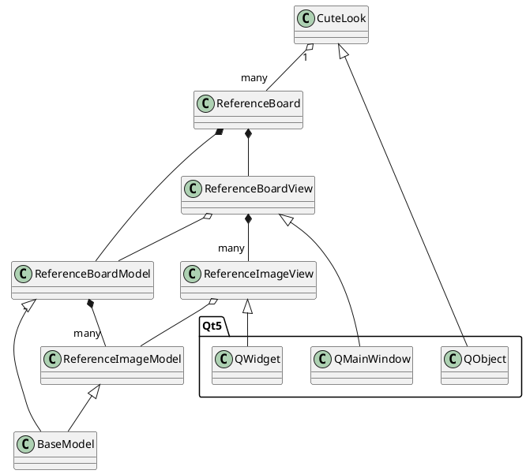

<br/>

# CuteLook
A simple application to help artist load and manage their reference images
<br/>
# Install

```bash
$ pip install -r requires.txt
```

<br/>

# Architecture


<br/>

# Future Features
<br/>

### FEAT-01: RefImageClip (subclass of RefImage)
   A "Clip" allows to separatelly display image details
   A Clip is made by copying on the fly an area of the original image and will stay linked to it
   The diplayed area can be can be moved, zoommed and resized but not panned (it will stay centered to the selection)

   ClipView: The clip view is a sub class of the RefImage view
       Additionally, hovering the ClipView a line linking the clip center to the center of the clipped image is displayed
<br/>
### FEAT-02: Text Annotation
   Allows adding small text note Images linked to a specific point in it.
   Hovering the TextNote a line linking the note to the center of the clipped image is displayed
<br/>
### FEAT-03: ColorSwatch
   Display edit e note with color swatch
<br/>
### FEAT-04: AutoColorSwatch
   A color swatch note auto-generatare from an image clip.
<br/>
### FEAT-05: Magnified Color Picker
   Generate on the fly a temporary, magnified, fixed size clip, annotated with the current pixel-unde-the-mouse color.
   - the clip view moves altougether with the pointer and repositioned to stay always inside the main view
   - while the magnification level is fixed, moving the mouse wheel the smoothing factor (number of adiacent pixels used to determine the picked color)
   - (optional) consider using edge-detection to avoid considering pixels non related to the pixel under the pointer
