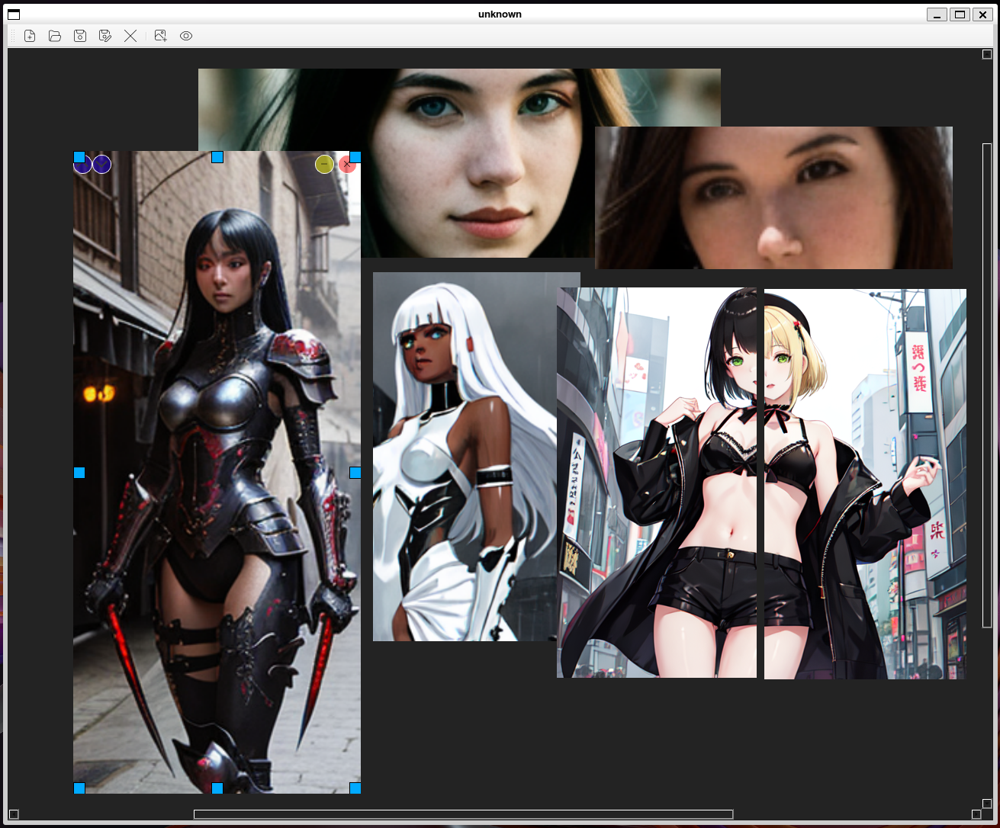

<br/>

# CuteLook

A simple application to help artist load and manage their reference images

<br/>



<br/>

Image mode:
- Description: allow basic image manipulation
- Available actions:
    - pan: click and drag
    - zoom: mouse wheel
    - crop:
    - raise:
Board mode:
- Description: is the default mode within wich you can arrange the images on the board
- Available Actions
    - resize/scale image
    - move image: left_click & drag
    - select/edit image: double click
    - open/close/hide images
    - zoom and pan board
<br/>

# Install

```bash
$ pip install -r requires.txt
```

<br/>

# Development Status
<br/>

A formal project - with tickets, kanban and all the bells and whistles - has not been opened for this project but the current development status, including implementation roadmap and issues/bugs tracking, con be found in [DevelopmentStatus.md](./docs/DevelopmentStatus.md)

# Architecture
<br/>

To support future developments and anybody who whould eventually use this project to learn coding and software design - beware that this application isn't meant to be a software design reference and I consider to take any possible shortcut in the implementation -, the application architecture is documented in [Architecture.md](./docs/Architecture.md).

# Notes on AI and generative tools
<br/>
Although 90% of the actual code has been written directly by hand (in the old fashined way :-)), AI generated code has been used the build the intial application prototype (it was about a the board with some floating images). That codes has been vastly rewriten and olny a few lines are still there but you can steel see it on the initial commits.

AI has been also used as support to quickly grasp libraries API usage and overcome my Python knowledge gap (this is my first more-than-a-script Python project).

