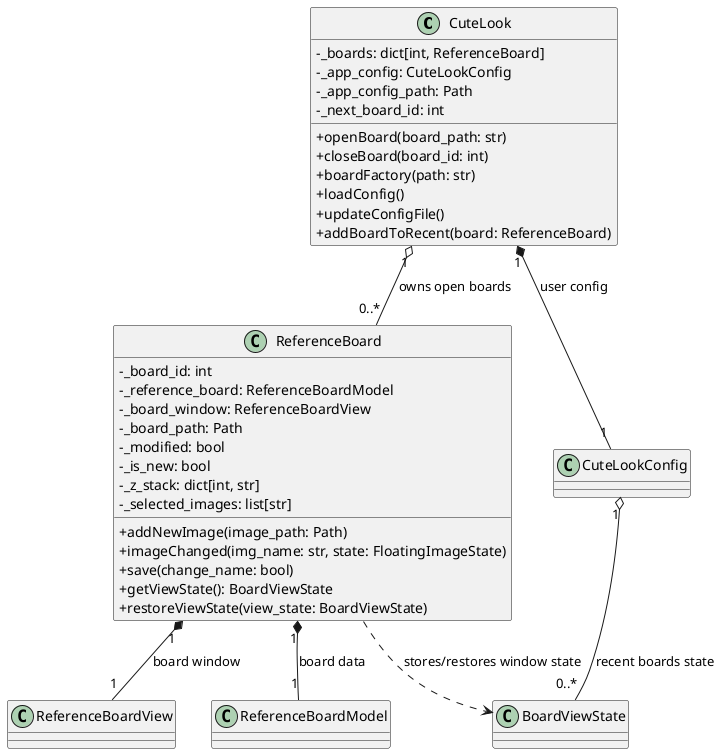
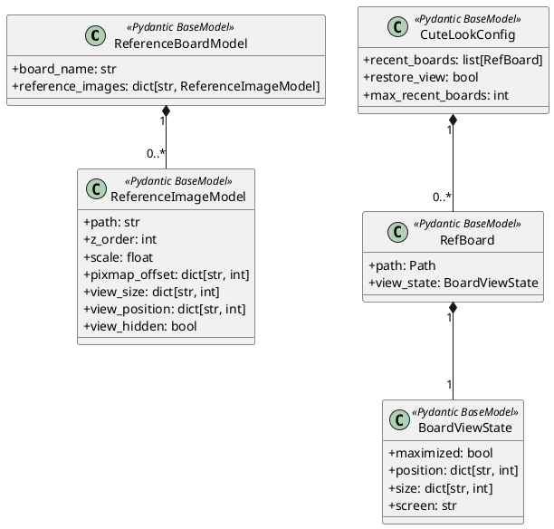
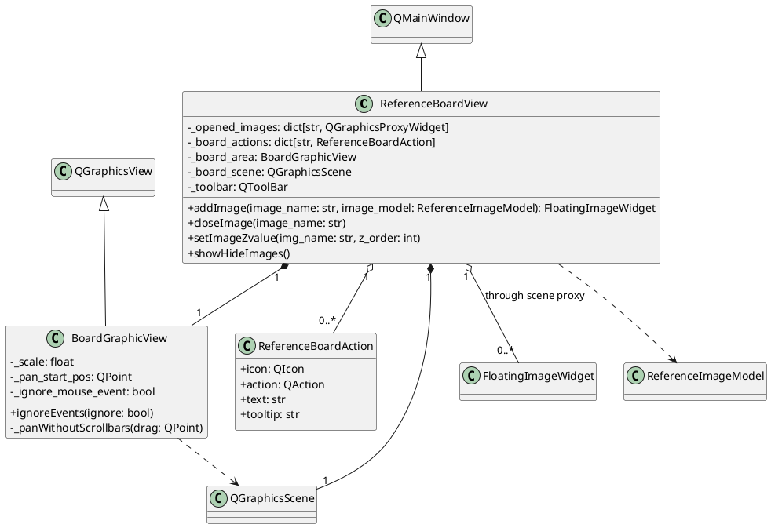
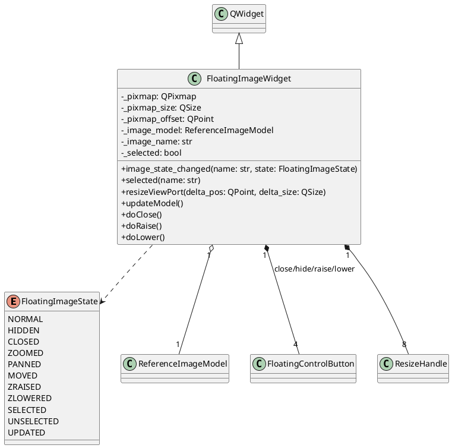
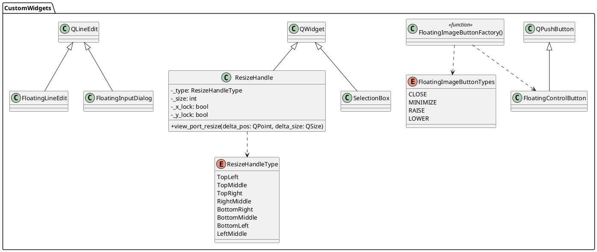
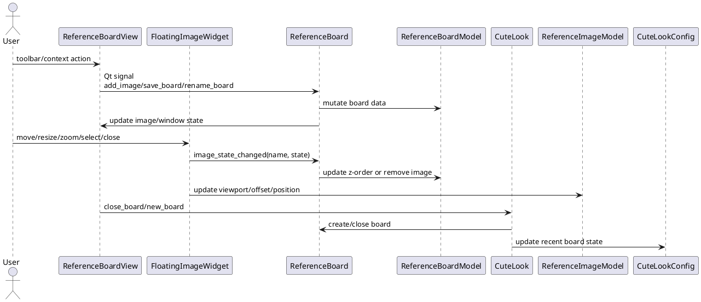

# Architecture

This document describes the current source structure of CuteLook.

CuteLook is a PyQt5 desktop application organized around a small manager/controller
layer, Pydantic models used for serialization, Qt views/widgets, and a package of
custom widgets used by floating reference images.

## Source Layout

```text
CuteLook.py                 Application entry point and board manager
ReferenceBoard.py           Board controller
ReferenceBoardView.py       Board main window and QGraphicsView
ReferenceImageView.py       Floating image widget and image interaction logic
ReferenceBoardModels.py     Pydantic board/image models saved to .refboard files
CuteLookConfig.py           Pydantic user configuration and recent board state
CustomWidgets/              Reusable widgets for image controls and editing
```

## Application And Board




`CuteLook` is not a `QObject`; it is a plain Python application manager. It creates
the board model, view, and controller, keeps the currently open boards indexed by a
session-local id, and stores the application configuration through `CuteLookConfig`.

`ReferenceBoard` is the controller for one board. It owns the current
`ReferenceBoardModel`, owns the `ReferenceBoardView`, connects view signals to board
operations, keeps selection state, and maintains the z-order stack used by floating
images.

## Serialization Models



`ReferenceBoardModel` and `ReferenceImageModel` are serialized into `.refboard`
files. They store the board name and the image-level state needed to restore each
reference image: source path, z-order, content scale, content offset, viewport size,
viewport position, and hidden state.

`CuteLookConfig` is serialized separately in the user configuration directory. It
stores application-level data such as recently opened boards and the saved window
state associated with those recent board entries.

## Board View Package



`ReferenceBoardView` is the main window for a board. It creates the toolbar and
context menu actions, owns a `QGraphicsScene`, and displays the scene through
`BoardGraphicView`.

Floating images are added to the scene with `QGraphicsScene.addWidget()`. The view
keeps the returned graphics proxy in `_opened_images` so it can change z-order,
show/hide images, or close them.

`BoardGraphicView` implements board-level zoom and middle-button panning.

## Floating Image View



`FloatingImageWidget` is the actual reference image view. It renders a scaled
`QPixmap`, clips it through the widget viewport, supports image-content panning,
content zoom, viewport resizing, whole-window movement, z-order changes, hide, and
close.

It updates the associated `ReferenceImageModel` whenever position, viewport size, or
pixmap offset changes, then emits `image_state_changed` so `ReferenceBoard` can mark
the board as modified or perform controller-level operations.

## CustomWidgets Package



`CustomWidgets` contains reusable UI pieces used by the board and floating images:
small floating control buttons, resize handles, the currently experimental
selection box, and inline/floating text inputs.

## Main Signal Flow



The application follows a pragmatic Model/View/Controller split:

- Pydantic models define serialized state.
- Qt widgets implement interaction and rendering.
- `ReferenceBoard` coordinates one model/view pair.
- `CuteLook` coordinates application-level lifecycle and configuration.
