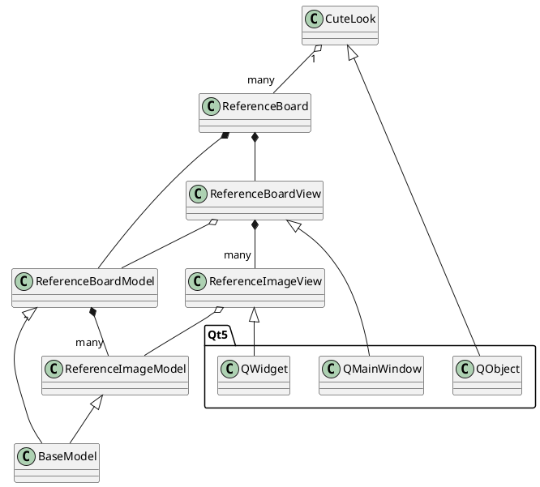

# Architecture
 

```plantuml
@startuml
	CuteLook <|-- Qt5.QObject
	CuteLook "1" o-- "many" ReferenceBoard
	ReferenceBoard *-- ReferenceBoardView
	ReferenceBoard *-- ReferenceBoardModel
	ReferenceBoardView <|-- Qt5.QMainWindow
	ReferenceBoardView *-- "many" ReferenceImageView
	ReferenceImageView <|-- Qt5.QWidget
	ReferenceBoardModel <|-- BaseModel
	ReferenceImageModel <|-- BaseModel
	ReferenceImageView o-- ReferenceImageModel
	ReferenceBoardView o-- ReferenceBoardModel
	ReferenceBoardModel *-- "many" ReferenceImageModel
@enduml
```
 
